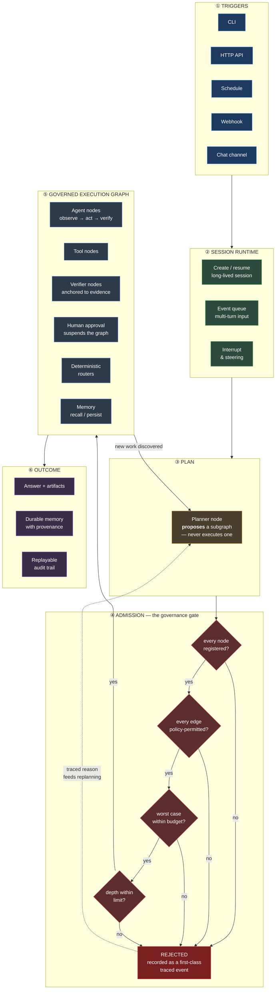
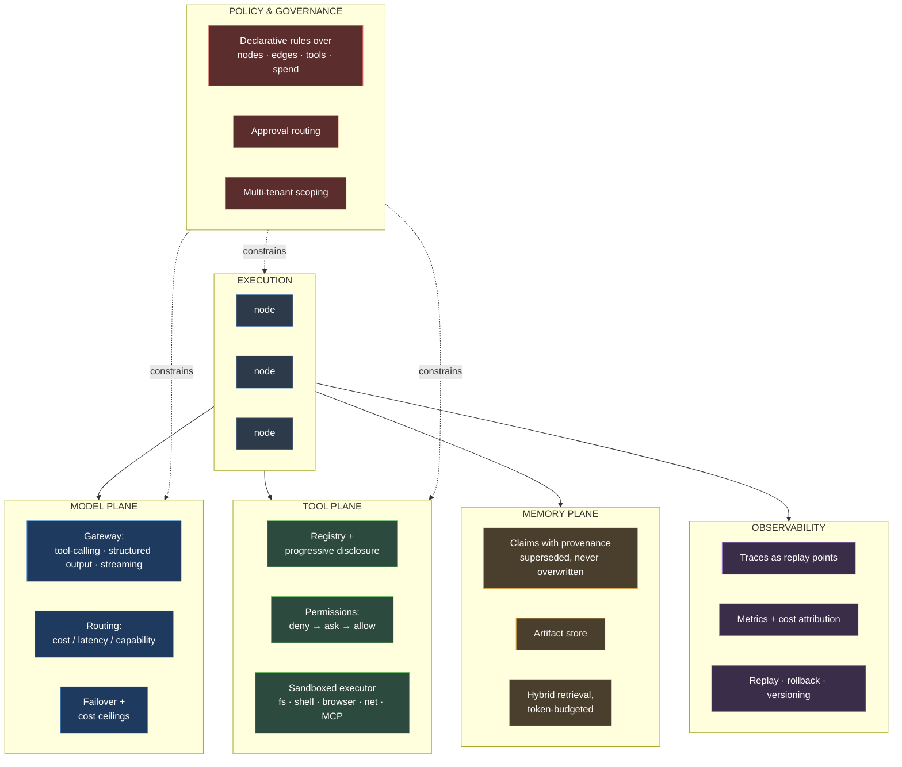

# GraphARC — the golden stage

The target architecture. This is what GraphARC is *trying to become*, not what
it is today ([ROADMAP.md](ROADMAP.md) tracks the distance; [ASSESSMENT.md](ASSESSMENT.md)
is honest about the gap). Read [VISION.md](VISION.md) first for the thesis.

**The one-sentence version:** a request enters, a planner *proposes* a subgraph,
an admission gate *authorizes* it, and only then does anything execute — so
every transition was permitted, every loop was bounded, and afterwards you can
prove exactly what happened and why it stopped.

---

## 1. End-to-end lifecycle

The loop from ⑤ back to ③ is the part that makes this general-purpose. Work
discovered mid-run doesn't bypass the gate — it re-enters through it.

---

## 2. The admission cycle — the crux

This is the component with no prior art to copy, and where most of the risk
lives. It is what lets the topology be dynamic without the governance being
advisory.

**The invariant:** a node may *propose* nodes and edges; it may never *execute*
them directly. Dynamism lives in construction, governance lives in admission.

**Why this matters.** Static graphs can't handle "investigate this incident" —
the shape is discovered while working. Fully dynamic loops can't tell you what
they were allowed to do. This splits the difference: the planner is as free as
you like, and nothing it invents runs until a deterministic checker says yes.

---

## 3. Planes — what every node sits on

Execution is the thin layer. The planes below are cross-cutting, and each is a
place where a promise is *enforced* rather than requested.

---

## 4. Inside an agent node

The reusable unit. Every gate here is code, not prompt text.

---

## 5. A worked example: "refactor this repo and run tests"

What the golden stage does with a real task.

Note what is *not* in this diagram: nowhere does the model decide it may write
to disk, spawn twenty workers, or touch `main`. Those are admission decisions.

---

## 6. The five invariants

If the golden stage means anything, it means these hold — and each is testable.

| # | Invariant | Enforced by |
|---|---|---|
| 1 | No transition executes that the graph did not permit | Admission checker (§2) |
| 2 | No work happens that the budget did not authorize | Budget meters, checked *and* enforced |
| 3 | A node may propose, never directly execute, new topology | Planner / admission split |
| 4 | Every rejection, stop, and refusal is recorded with a reason | Traces as first-class events |
| 5 | Any run can be replayed and attributed after the fact | Checkpoints + trace + versioned config |

**The test of the whole design:** after an incident you must be able to answer
three questions from the record alone — *what did it do*, *what was it allowed
to do*, and *why did it stop*. Every mainstream harness today answers the first
one well, the second one vaguely, and the third one not at all.

---

## 7. Where we are against this

| Stage | Status |
|---|---|
| ① Triggers | demo CLI only |
| ② Session runtime | not started |
| ③ Planner | not started |
| ④ **Admission** | **not started — the crux** |
| ⑤ Execution graph | kernel ~70%; agent nodes 0% |
| ⑥ Outcome | traces yes; durable memory no |
| Model plane | ~15% — text-only, no tool-calling |
| Tool plane | ~30% — built, wired to nothing |
| Memory plane | ~20% — dies with the process |
| Policy | not started |
| Observability | ~20% |

The shortest path onto this diagram is §4 — the agent node — because it is the
first box that requires the model plane, tool plane, and kernel to work
together at all. See [ROADMAP.md](ROADMAP.md).
