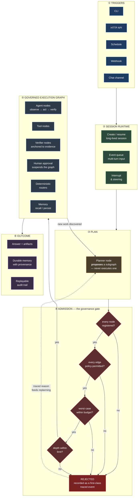
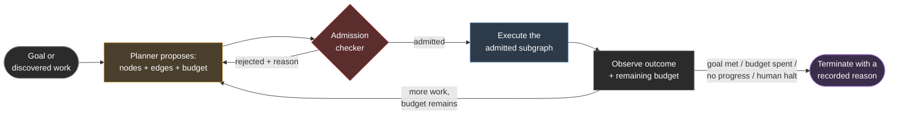
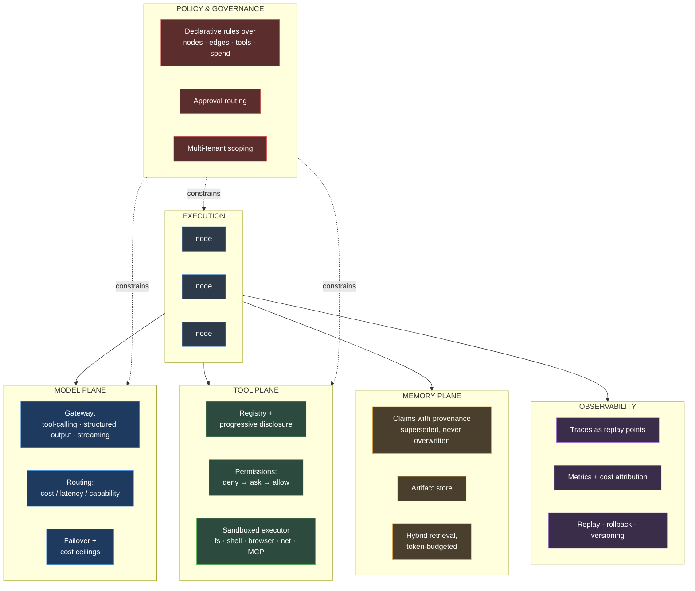
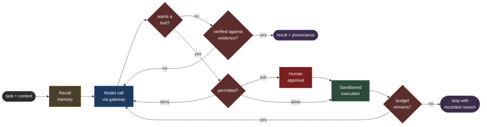
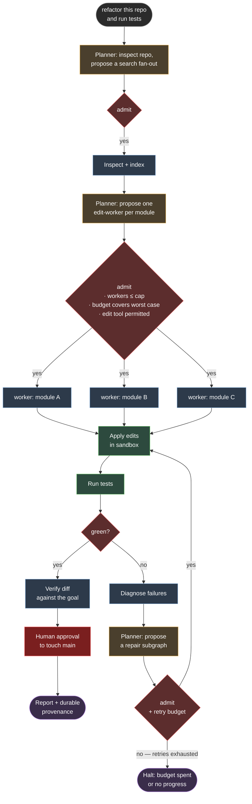

# GraphARC — the golden stage

The target architecture. Most of it now exists: §7 re-derives every box against
the tree by running it, and says plainly which ones are still diagrams.
([ROADMAP.md](ROADMAP.md) tracks the remaining distance; [ASSESSMENT.md](ASSESSMENT.md)
is an outside review of an earlier state of this repo, kept on purpose.) Read
[VISION.md](VISION.md) first for the thesis.

**The one-sentence version:** a request enters, a planner *proposes* a subgraph,
an admission gate *authorizes* it, and only then does anything execute — so
every transition was permitted, every loop was bounded, and afterwards you can
prove exactly what happened and why it stopped.

---

## 1. End-to-end lifecycle

The loop from ⑤ back to ③ is the part that makes this general-purpose. Work
discovered mid-run doesn't bypass the gate — it re-enters through it.

---

## 2. The admission cycle — the crux

The component with no prior art to copy, and where most of the risk lived. It
is what lets the topology be dynamic without the governance being advisory.
This cycle is implemented — `grapharc/planner/` — and §7 records the run that
demonstrates it end to end.

**The invariant:** a node may *propose* nodes and edges; it may never *execute*
them directly. Dynamism lives in construction, governance lives in admission.

**Why this matters.** Static graphs can't handle "investigate this incident" —
the shape is discovered while working. Fully dynamic loops can't tell you what
they were allowed to do. This splits the difference: the planner is as free as
you like, and nothing it invents runs until a deterministic checker says yes.

**How the invariant is actually held**, since "may never execute" is the sort of
promise a design document makes and code quietly breaks:

- A `Subgraph` is a Pydantic model with `extra="forbid"`. A proposal carrying a
  `body` or an `fn` is a `ValidationError`, so there is no channel through which
  a planner could hand over a callable at all. Every node body comes from the
  operator's `NodeSpec.factory`, registered before any planning happened.
- Every gate keys on the registry `kind`, never on the instance `name` a planner
  invented. `ProposedNode(name="harmless_helper", kind="deploy")` is refused by
  a rule denying `deploy`; renaming cannot launder a kind, and naming an
  instance after a permitted kind cannot borrow its permission.
- Worst-case cost is summed from the registry's own figures for the kinds
  proposed. A proposal cannot claim to be cheap.
- `Materializer.materialize(admitted, proposal)` takes the `AdmissionResult`
  first and matches it to the proposal *by fingerprint*. A result that
  authorised a different proposal raises `NotAdmitted`; so does a result whose
  status was `rejected`. There is no overload that accepts a bare `Subgraph`.
- Once built, a body that returns `Command(goto=…)` is confined to destinations
  the admitted proposal declared an edge to, raising `UnadmittedTransition`
  otherwise. The admitted *edge set* bounds dynamic routing, not merely the
  admitted node set.

And the edge the gate does not cover, stated here rather than discovered later:
**admission authorises a kind, never that kind's arguments.** No rule can
constrain `ProposedNode.args`, so a proposal carrying
`args={"path": "/etc/passwd"}` is admitted on the strength of its kind alone.
`Materializer` therefore drops `args` by default (`forward_args=False`); turning
that on hands a model's unchecked dictionary to a factory, and gating it is
then the factory's job.

---

## 3. Planes — what every node sits on

Execution is the thin layer. The planes below are cross-cutting, and each is a
place where a promise is *enforced* rather than requested.

---

## 4. Inside an agent node

The reusable unit. Every gate here is code, not prompt text.

---

## 5. A worked example: "refactor this repo and run tests"

What the golden stage does with a real task.

Note what is *not* in this diagram: nowhere does the model decide it may write
to disk, spawn twenty workers, or touch `main`. Those are admission decisions.

---

## 6. The five invariants

If the golden stage means anything, it means these hold — and each is testable.

| # | Invariant | Enforced by |
|---|---|---|
| 1 | No transition executes that the graph did not permit | Admission checker (§2) |
| 2 | No work happens that the budget did not authorize | Budget meters, checked *and* enforced |
| 3 | A node may propose, never directly execute, new topology | Planner / admission split |
| 4 | Every rejection, stop, and refusal is recorded with a reason | Traces as first-class events |
| 5 | Any run can be replayed and attributed after the fact | Checkpoints + trace + versioned config |

**The test of the whole design:** after an incident you must be able to answer
three questions from the record alone — *what did it do*, *what was it allowed
to do*, and *why did it stop*. Every mainstream harness today answers the first
one well, the second one vaguely, and the third one not at all.

---

## 7. Where we are against this

Re-derived on 2026-07-28 by executing each claim against the tree — not by
reading the commit log. At that point `pytest` was **1,381 passed, 10
deselected** (the live ones), `ruff check .` was clean, and the wheel built and
imported all 94 submodules in a clean virtualenv.

| Stage | Status | The honest edge |
|---|---|---|
| ① Triggers | **CLI (9 commands) + HTTP API with SSE** | no cron, no webhook, no chat channel |
| ② Session runtime | **built and durable** | the HTTP API does not use it — see below |
| ③ Planner | **built** — `PlannerNode.propose()` emits a typed `Subgraph` and runs nothing | |
| ④ **Admission** | **built** — five checks, model-free, every decision traced | authorises a *kind*, never its arguments |
| ⑤ Execution graph | **kernel async and complete enough to serve; `AgentNode` drives tools** | `interrupt()` suspends but has no supported resume |
| ⑥ Outcome | **replay, diff, OTel spans, cost attribution, durable claims + artifacts** | no `cost_usd` is ever written to a trace, so money is an estimate |
| Model plane | **tool-calling, structured output, streaming, async, retries, enforced cost ceilings** | two backends (Claude CLI, OpenRouter); no direct Anthropic, no local |
| Tool plane | **seven core tools, workspace-confined; container executor exists** | the default audit-hook executor is still not a kernel boundary |
| Memory plane | **SQLite claims + artifacts, BM25F + graph traversal, contradiction detection** | the CLI still hands graphs the in-process store |
| Policy | **TOML document, tiered decisions, approval routing, digest-stamped audit log** | nothing in the package calls it |
| Observability | **replay · diff · spans · cost, all off the one trace file** | no rollback, no versioned configs, no alerting |

**The loop in §2 is closed.** `planner.propose → checker.check → materializer →
execute → observe → replan` runs today as `GovernedLoop.run()`. Driven with a
scripted planner whose first proposal names a policy-denied `deploy` node, the
observed behaviour is: round 1 rejected on `policy/edge_denied` with the reason
handed back as the planner's next feedback; round 2 admitted, materialised and
executed; round 3 admitted and executed; stop reason `goal_met`. The trace holds
three `phase="admission"` events, three `phase="round"` events, the executed
nodes' own `start`/`end` pairs and one `phase="stop"` event, all under one
`run_id`. Round 7 is checked by the same checker as round 1 — there is no
already-approved path.

### The gaps that matter

One seam is left: a subsystem that exists and works, sitting next to a
subsystem that does not know it exists. It is ROADMAP §12.3. Two gaps that were
here are closed, and are recorded below so the shape of the fix is not lost.

1. *Closed — the loop has a surface.* `grapharc plan <goal>` drives propose →
   admit → materialise → execute → replan and prints every round with its
   admission status and rejection codes. ①→③ is a path, not a diagram.
   `grapharc/examples/plan_incident.py` supplies the kinds; `--registry
   module:attr` replaces them, along with the `STATE_SCHEMA` and `WRITES` a
   registry needs to be usable.
2. *Closed — policy reaches admission.* `PolicyEngine.edge_policy(tenant=…)`
   compiles the document's `edge` rules into the `EdgePolicy` the checker
   consults, mirroring `permission_policy()` on the tool side, and `grapharc
   plan --policy` calls it. Box ④ can now be enforced by the declarative
   document. What the compiled object still cannot carry is the approver role
   and the audit record, because `EdgePolicy.decide` returns a bare `Decision`;
   and nothing yet routes the *tool* plane through the document, so `grapharc
   agent` is still governed by Python objects.
3. **The HTTP API and the session runtime are two different things.**
   `grapharc/session` gives durable, cross-process sessions: verified by running
   one interpreter to an approval hold and resuming it by id in a second, with
   each node appearing exactly once in the append-only log. `grapharc/server`
   does not use it — it has its own `InProcessRuntime` whose sessions die with
   the process, never evict, and record `message`/`approval` events without
   delivering them into a running graph. Stage ② holds; stage ① does not reach it.
4. *Closed — the shipped graphs can use durable memory.* `grapharc run
   --memory PATH` hands `stage6` and `capstone` a `SQLiteMemoryStore`, verified
   across a real process boundary; in-process remains the default so a plain run
   writes nothing nobody asked for. Box ⑥'s "durable memory with provenance" is
   now true of something you can run.

The fifth is not a seam but a boundary, and it is the one most likely to be
over-read:

5. **Admission authorises a kind, not its arguments.** Stated in §2 and true in
   code: a proposal carrying `args={"path": "/etc/passwd"}` is admitted, because
   no rule here can constrain `args`. `Materializer` defaults to
   `forward_args=False` and drops them, which is the right default — but
   `forward_args=True` hands the planner's unchecked dictionary straight to a
   factory, and at that point the gate has authorised the verb and not the
   object.

### Where the invariants of §6 actually stand

| # | Invariant | Holds? |
|---|---|---|
| 1 | No transition executes that the graph did not permit | **Yes, within a materialised subgraph** — a body's `Command(goto=…)` is confined to the admitted edge set, raising `UnadmittedTransition` otherwise |
| 2 | No work happens that the budget did not authorize | **Yes for tokens, iterations and wall-clock**; USD ceilings are enforced by `SpendMeter` on calls the provider prices, and unpriced calls are counted rather than guessed |
| 3 | A node may propose, never directly execute, new topology | **Yes** — `Subgraph` forbids extra fields, so a proposal has no channel for a callable; every body comes from the operator's `NodeSpec.factory` |
| 4 | Every rejection, stop, and refusal is recorded with a reason | **Yes** — `phase="admission"` for every decision, `phase="stop"` with a `LoopStop`, and a `StopReason` on every convergence exit |
| 5 | Any run can be replayed and attributed after the fact | **Reconstructed, not re-executed.** `replay()` rebuilds the node sequence, folded state and timing off the JSONL; it calls no model, tool or node. Attribution is per run, thread and node — there is no tenant on a trace event |

The shortest path onto this diagram is no longer a subsystem — it is a *seam*.
See [ROADMAP.md](ROADMAP.md).
