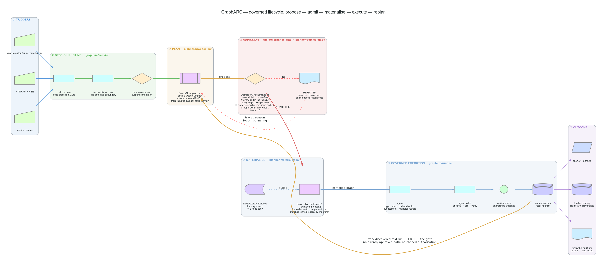

# GraphARC

**A governed agent runtime built on [LangGraph](https://github.com/langchain-ai/langgraph).** A planner *proposes* a subgraph, a deterministic checker *admits* it, and only then does anything execute — so every transition was permitted, every loop was bounded, and afterwards you can prove what happened and why it stopped. Underneath that sits the discipline layer it grew out of: typed state contracts, per-node write permissions, enforced budgets, and JSONL traces that double as replay points.

Alpha (`0.1.0a0`). Installable from source; not on PyPI yet — see [Install](#install).

> *Graph engineering*: when one agent loop stops being enough, coordination becomes the engineering. Nodes do work (agent loops, model calls, deterministic functions, humans approving things), edges decide what runs next, and a typed shared state flows between them. GraphARC implements the discipline that makes such graphs production-grade rather than demos — the ideas emerging from the July 2026 loops-vs-graphs debate (Steinberger, Ng, et al.), the "Two Graphs, Two Jobs" split, and twenty years of pre-AI graph systems where every edge means something and every path can be explained.



The two curves back to *③ PLAN* are the claim. Refusals return as traced reason codes, and work discovered mid-run **re-enters admission** — there is no already-approved path and no cached authorisation. Rendered from [`docs/diagrams/architecture.py`](docs/diagrams/architecture.py); [three more views](docs/diagrams/) cover the planes, the agent node, and which subsystems actually import which.

## What's here

| | | |
|---|---|---|
| **Kernel** | typed state, declared writes, budgets, traces, fan-out, async | `grapharc.runtime` |
| **Planner + admission** | propose a subgraph, admit it or reject it with reasons, materialise, replan | `grapharc.planner` |
| **Agent node** | observe → model → permission check → sandboxed tool → repeat | `grapharc.harness` |
| **Tools** | seven core tools, workspace-confined; container executor | `grapharc.tools` |
| **Sessions** | long-lived, resumable across processes, human approval gates | `grapharc.session` |
| **HTTP API** | FastAPI + SSE | `grapharc.server` |
| **Policy** | TOML rules over nodes, edges, tools and spend; decision audit | `grapharc.policy` |
| **Memory** | durable claims with provenance, artifacts, BM25F + graph retrieval | `grapharc.memory` |
| **Observability** | replay, run diffing, OpenTelemetry spans, cost attribution | `grapharc.observe` |

Every box above is now reachable from a shipped command. `planner` and `policy` were for a while built, tested and imported by nothing else in the package; `grapharc plan` drives the first and compiles the second's document into the gate. [ROADMAP.md](ROADMAP.md) §12 tracks the seams that remain — the HTTP API still runs its own in-process session layer instead of the durable one — and [ARCHITECTURE.md](ARCHITECTURE.md) §7 re-derives every box above by running it.

## What it adds on top of LangGraph

Everything in this table is enforced by the library rather than left to convention, and has a test you can run.

| Discipline | Mechanism |
|---|---|
| Write permissions | Every node declares which state fields it may write. An undeclared write raises `WritePermissionError`; plain LangGraph applies it and moves on. |
| State isolation | Nodes receive `state.model_copy(deep=True)`, so mutating a nested model in place cannot sneak past the declared write channel — the returned dict is the only way out of a node. |
| Typed state | Schemas are Pydantic models with `extra="forbid"`. Declaring a write to a field that doesn't exist fails when the node is added, not when it runs. |
| Earned cycles | `dag=True` rejects conditional and fan-out edges when they're added, and cycles at compile time — Stage 0 before Stage 2. |
| Code-only routing | Routers are ordinary Python functions over typed state, so model prose cannot steer an edge. A node may also return `Command(goto=…)` for dynamic routing — still code — and the destination is validated against the compiled graph at the node boundary. |
| Convergence | `ProgressGuard` returns the first triggered `StopReason` (target met / no progress / round cap), so a cycle ends with a machine-readable reason instead of running out of road. |
| Traces | Each node execution writes JSONL `start` / `end` / `error` events. `start` carries only the identity of the step (run, thread, attempt, graph, node, step, timestamp); `end` adds the state delta, duration and tokens; `error` adds the duration and the exception. `metrics`, `viz`, `replay`, `diff` and the OTel exporter read that same file, so the dashboard and the audit trail cannot disagree. |
| Fail-closed entry points | Driving a compiled graph through raw LangGraph (`.inner.invoke()`) raises `MissingRunContextError` rather than silently running with no budget and no trace. |
| Bounded work | A per-run `Budget` (iterations / tokens / seconds / concurrency). Iterations and tokens are metered by the runtime itself, and `max_seconds` is delivered as an interrupt *into* the running node rather than only checked between them. |
| Checked state edits | `update_state()` is not a passthrough: it rejects unknown fields, type-checks the values, and — given `as_node=` — applies that node's declared write allowlist. |
| Governed topology | New nodes and edges proposed at runtime go through a deterministic admission gate before anything is built. See [The admission gate](#the-admission-gate). |

Three of those need their edges stated, because the gap is where people get hurt.

**Budgets.** Tokens are charged without the node's cooperation: a LangChain callback is installed for the duration of every node, so any chat model invoked on that thread reports usage to the run's meter — including calls buried inside library code the node merely calls — and the ceiling is enforced at the node boundary. `max_seconds` is an interrupt, not a poll: SIGALRM on the main thread, an asynchronous exception otherwise, so a node parked in `time.sleep` or on a provider's socket is cut off at the deadline. Where it stops short: spend a provider never reports cannot be charged, a model invoked on a thread the node started itself is outside the callback's context, and an async exception cannot unwind a thread sitting inside a C call — it lands when that call returns. Even then the deadline holds at the node boundary: a node that overran does not get its writes into state.

**Routing.** The routers are code, which is the property that matters: no model output is ever consulted to pick an edge. But `add_conditional_edge` passes the router and its mapping straight through to LangGraph — GraphARC does not verify that the router's return value is a key in the mapping, so a typo surfaces as a `KeyError` at run time rather than when the edge is added.

**Typing.** Writes are checked in both directions: the dict a node returns is validated field by field against the state schema before it lands, and the state is validated again when the next node receives it. A value that doesn't fit raises `StateTypeError` naming the node, the field, the declared type and what arrived — and that includes the last node before `END`, so a bad type no longer escapes into the result. The validated value is what gets written, so a schema that says `int` means the result holds an `int`. The remaining gap is narrow and worth stating exactly: write-time validation is built from each field's *annotation*, so constraints carried in the annotation (`Annotated[int, Field(gt=0)]`) do bite, but a validator the state model declares for itself — `@field_validator`, `@model_validator` — is not run on a write. A node returning `{"slug": "NOT-LOWER"}` into a field whose validator demands lowercase is accepted, even though constructing the model directly with that value raises; the violation surfaces only when a later node receives the state and the whole model is rebuilt, which means one written by the last node before `END` still reaches the result. The write *allowlist* is GraphARC's; the *types* are Pydantic's.

**Crash-safe resume is LangGraph's**, not GraphARC's: a checkpointer handed to `compile()` goes straight to `StateGraph.compile()`. What GraphARC adds on top is trace continuity — after a resume, step numbers continue from the thread's history and the attempt counter increments, so replay points stay unique across attempts. What `grapharc.session` adds on top of *that* is everything the kernel deliberately does not know about: who is driving the thread, what has been said to it since it last ran, and whether a human still has to sign something off.

**Async is carried through.** `ainvoke`, `astream` and `astream_events` all run through the same disciplined path — budgets, traces and write permissions apply unchanged — and `async def` nodes execute. The sync entry points refuse a graph containing them with `AsyncNodeError` *before* anything runs, rather than letting LangGraph execute every sync node first and fail at the first coroutine. `astream_events` offers `v1` and `v2`; `v3` is refused because LangGraph returns a stream object there rather than an async iterator, which is a different contract than the method's.

## Install

This works now. It did not for most of the project's life — the public remote held only `LICENSE`, `README.md` and `.gitignore`, so a clone had no `pyproject.toml` to sync and the instruction below was fiction. The source is pushed; a fresh clone was verified to contain `pyproject.toml` and the `grapharc/` package.

```bash
git clone https://github.com/CodeGraphContext/GraphARC
cd GraphARC
uv sync --group dev              # Python >= 3.12
uv sync --all-extras --group dev # everything: openrouter, server, otel, mcp, api
```

Not on PyPI yet. The wheel does build: `uv build` produces one that installs into a clean virtualenv, imports every one of the package's 94 submodules with `[all]` (`gateway.openrouter` and the whole `server` package need their extras, so a bare install imports fewer), and runs `grapharc run stage0`.

## Quickstart

```bash
grapharc run stage0        # deterministic DAG: load -> split -> count -> report
grapharc run stage1        # one earned agent loop: discover -> act -> verify -> repeat
grapharc run stage2        # typed cyclic graph: extract claims -> verify -> retry
grapharc run stage3        # bounded fan-out with failure isolation and dedup
grapharc run stage4        # bounded investigation loop with convergence guards
grapharc run stage5        # verifier: fresh context + deterministic evidence anchor
grapharc run stage6        # memory: provenance, supersession, recall
grapharc run capstone      # all of the above in one research agent

grapharc agent "fix the failing test" --workspace ./sandbox   # agent + the seven core tools
grapharc serve --port 8000       # the HTTP API (needs the `server` extra)

grapharc models                  # what a model spec resolves to
grapharc trace <path>            # pretty-print a run trace
grapharc metrics <path> <run-id> # tokens, retries, termination reason, per-node counts
grapharc viz <path> <run-id>     # Mermaid diagram of the executed path
grapharc replay <path> <run-id>  # reconstruct a run from its trace
grapharc diff <path> <a> <b>     # what changed between two runs
```

Nine commands, and every one of them takes `--json` — in JSON mode the failure is the document rather than a line on stderr. Exit codes are part of the interface: `0` did the job, `1` ran and the answer was negative (an agent stopped short, a run id had no events, two runs differed), `2` could not run at all.

The `run` stages use scripted models by default, so they cost nothing and produce the same trace every time. Add `--model` to run one against a real backend — that works for stage1 through stage6 and the capstone; stage0 is pure code with no model in it. `grapharc agent` is the exception: it needs a tool-calling backend and says so rather than degrading, because a scripted model has no `bind_tools` to drive a tool loop with.

Building a graph:

```python
from grapharc import GraphARC, GraphARCState, Budget
from grapharc.runtime.graph import START, END

class State(GraphARCState):
    question: str
    answer: str = ""

def answer(state: State) -> dict:
    return {"answer": f"42 (asked: {state.question})"}

g = GraphARC(State, name="demo", budget=Budget(max_iterations=10))
g.add_node("answer", answer, writes={"answer"})   # undeclared writes raise
g.add_edge(START, "answer")
g.add_edge("answer", END)
print(g.compile().invoke({"question": "meaning of life"}))
```

## The admission gate

The part with no prior art to copy, and the reason the rest exists. You cannot pre-author a graph for "investigate this incident" — the shape is discovered while working. So the graph is built at runtime, and a deterministic checker stands between building it and running it.

Watch it happen first. This costs nothing and needs no key — the shipped planner is scripted, and its first proposal names the policy-denied `deploy` kind:

```bash
grapharc plan "investigate the checkout outage"
```

```
goal      : investigate the checkout outage
model     : scripted
registry  : grapharc.examples.plan_incident:build_registry
kinds     : deploy, patch, triage, verify
policy    : built-in demo (deny -> deploy, allow otherwise)

stopped   : goal_met  (the goal check was satisfied)
rounds    : 2 of max 8
   round 1: rejected  nodes=2 executed=False  rejected: edge_denied
   round 2: admitted  nodes=3 executed=True

state     : goal='investigate the checkout outage' notes=['triage ran', 'patch ran', 'verify ran']
```

Round 1 wanted to deploy and **never executed**. Round 2 went through the *same* checker and ran. `--model SPEC` swaps in a real backend and changes none of the enforcement; `--policy policy.toml` moves the rules into a document.

Here is the assembly, complete and runnable as written:

```python
from pydantic import BaseModel

from grapharc.harness.permissions import Decision
from grapharc.planner import (
    AdmissionChecker, CostEstimate, EdgePolicy, EdgeRule, GovernedLoop,
    LoopLimits, Materializer, NodeRegistry, NodeSpec, PlannerNode,
)
from grapharc.runtime.budget import Budget
from grapharc.testing import ScriptedChatModel


class State(BaseModel):
    found: str = ""
    fixed: str = ""


def factory(spec):                              # bodies come from HERE, never a proposal
    def body(state):
        return {"found": "cause"} if spec.name == "search" else {"fixed": "patch"}
    return body


registry = NodeRegistry([                        # the kinds a planner may propose
    NodeSpec(name="search", factory=factory, worst_case=CostEstimate(tokens=500)),
    NodeSpec(name="edit",   factory=factory, worst_case=CostEstimate(tokens=2000)),
    NodeSpec(name="deploy", factory=factory),
]).freeze()
policy = EdgePolicy(rules=(                      # deny -> ask -> allow, unmatched is deny
    EdgeRule(action=Decision.DENY, target="deploy"),
    EdgeRule(action=Decision.ALLOW),
))

plan = '{"nodes": [{"name": "%s"}], "edges": [{"source": "__start__", "target": "%s"}]}'
loop = GovernedLoop(
    planner=PlannerNode(
        ScriptedChatModel(responses=[plan % ("deploy", "deploy"), plan % ("edit", "edit")]),
        catalog=registry.catalog(),
    ),
    checker=AdmissionChecker(registry=registry, edge_policy=policy),
    materializer=Materializer(
        registry=registry, state_schema=State,
        writes={"search": {"found"}, "edit": {"fixed"}, "deploy": set()},
    ),
    budget=Budget(max_tokens=100_000),
    limits=LoopLimits(max_rounds=8),
    goal_reached=lambda s: bool(s.fixed),
)
result = loop.run("find and fix the bug", State())

print(result.stop.value)
for record in result.rounds:
    print(record.round, record.admission.status.value, record.executed)
print([r.code for r in result.rejections()])
```

Output:

```
goal_met
1 rejected False
2 admitted True
['edge_denied']
```

The trace holds an `admission` event per round, a `round` event per round, the executed nodes' own `start`/`end` pairs and one `stop` event, all under one `run_id` — so *what it did*, *what it was allowed to do* and *why it stopped* are answerable from the file alone. Round 7 is checked by the same checker as round 1; there is no already-approved path.

Both blocks above are executed by `tests/test_readme.py`, which byte-compares this page's output against a real run, so neither can rot quietly.

**Five checks, all of which run on every proposal**, so a planner gets the complete list of objections rather than the first one: is every node's kind in the registry, is every edge permitted between the kinds it joins, does the worst case fit what is *left* of the budget, is the nesting within the depth limit, and is it acyclic.

What that buys, stated as properties rather than adjectives:

- **Nothing runs during a check.** `NodeSpec.factory` is never called and the budget meter is read, not written. An over-budget proposal is refused before its first node exists.
- **A rejection is data.** There is no "admit a reduced version", no truncated fan-out, no downgraded edge. `AdmissionResult.feedback()` — the per-check list with codes and remedies — is handed back to the planner as its next round's input, and the loop never retries an identical proposal, because the checker is deterministic and would give the same answer.
- **Costs come from the registry, never the proposal.** A planner cannot buy admission by claiming to be cheap.
- **Every decision keys on the registry `kind`, never the instance `name`.** `ProposedNode(name="harmless_helper", kind="deploy")` is refused by a rule denying `deploy`. Renaming cannot launder a kind, and naming an instance after a permitted kind cannot borrow its permission.
- **A proposal cannot carry code.** `Subgraph` and `ProposedNode` are Pydantic models with `extra="forbid"`, so a `body=` or `fn=` key is a validation error. Every node body comes from a factory the operator registered before any planning happened.
- **Materialisation binds to the authorisation.** `Materializer.materialize(admitted, proposal)` takes the `AdmissionResult` first and matches it to the proposal *by fingerprint*; a result that authorised something else raises `NotAdmitted`, and so does a rejected one. Afterwards, a body returning `Command(goto=…)` is confined to destinations the admitted proposal declared an edge to.
- **Every decision is traced**, admitted and rejected alike, as a `phase="admission"` event carrying the status, fingerprint, checks run and failed codes. The phase is deliberately not `"end"`, so admission decisions cannot inflate the node-execution counts `metrics` reports.

Three limits, because this is exactly the sort of claim people over-read:

**Admission authorises a kind, not its arguments.** No rule reaches `ProposedNode.args`, so a proposal carrying `args={"path": "/etc/passwd"}` is admitted on the strength of its kind alone. `Materializer` drops args by default (`forward_args=False`); turning that on hands a model's unchecked dictionary to your factory, and gating it becomes the factory's job.

**`parent_depth` is the caller's word.** The checker cannot see how deep the run actually is, so a caller that always passes `0` has no recursion limit beyond the nesting visible inside a single proposal.

**One surface, one demo registry.** `grapharc plan` drives the loop, and the kinds it plans over come from `grapharc/examples/plan_incident.py` unless you point `--registry module:attr` at your own. That module is also where a custom registry declares its `STATE_SCHEMA` and `WRITES`; a registry alone is not enough, because a kind nobody declared writes for may write nothing. There is no session-backed or HTTP-backed planning surface yet — [ROADMAP.md](ROADMAP.md) §12.3.

## The model gateway

The primary backend drives the **Claude Code CLI** (`claude -p`), so GraphARC runs on a Claude subscription with no API key. That CLI is a full agent, so the adapter invokes it as a pure inference endpoint: every tool disallowed, no settings sources loaded, no CLAUDE.md pickup, prompt via stdin, flags via an argv array — never a shell string. An injected "run this command" has no tool to run it with.

```python
from grapharc.gateway import get_model

# Subscription, no API key — but text completion only.
worker = get_model("claude-cli/claude-sonnet-5")

# OpenRouter: one key for a catalog spanning most vendors, with
# tool-calling, structured output, streaming, and async.
worker   = get_model("openrouter/anthropic/claude-haiku-4.5")
reviewer = get_model("openrouter/openai/gpt-4o-mini")   # a genuinely different vendor
```

A spec is `backend/model`; a mistyped backend is rejected rather than quietly folded into a model name. `grapharc models` shows what a spec resolves to.

Run an example graph against real models:

```bash
grapharc run stage5 --model openrouter/anthropic/claude-haiku-4.5 \
                    --reviewer-model openrouter/openai/gpt-4o-mini
```

OpenRouter also carries routing: model-level `fallback_models` chains, provider `order` / `sort` / `max_price`, and per-call cost in the usage envelope. Both backends report usage in the same shape, with cached input folded into the total, so a budget meter reads the same fields whichever backend produced the turn.

**Retries have a policy, not a loop.** Three attempts by default, 0.5s initial backoff doubling to a 20s cap, with jitter drawn from `[0.75, 1]` — shrinking rather than centred, so successive delays stay strictly increasing rather than merely trending upward. What gets retried is the deliberate part: a timeout, a connection reset, a 429 or a 5xx is transient and re-issued; a 400, 401, 402, 403 or a content refusal is a verdict that will not change and is raised on the first attempt; anything unrecognised is treated as deterministic rather than retried hopefully. A `Retry-After` header raises the delay but never lowers it, and is itself capped. Streaming is not retried — once a chunk has reached the caller the request cannot be re-issued transparently.

**Cost ceilings are enforced, on both sides of a call.** A `SpendMeter` refuses before a call once the ceiling is reached, and after a call it charges the cost and *then* raises if that crossed the line — so overspend is bounded by the single call that crossed it rather than discovered a node later. The limit worth stating: a call whose cost the provider does not report cannot be charged, and those land in `unpriced_calls` rather than being guessed at. `unpriced_calls > 0` means the ceiling saw less than the whole bill.

Caveats each backend accepts openly. **Claude CLI:** `bind_tools` and `with_structured_output` raise `NotImplementedError` — the adapter implements neither, so what you get is LangChain's `BaseChatModel` default, and `claude -p` in the tool-free mode GraphARC drives it in offers nothing to implement them with. GraphARC also has no cache control on this path — the CLI decides and the usage envelope reports what it did — and calls spend subscription quota. **OpenRouter:** credit is reserved against `max_tokens`, so the default is deliberately modest. **Both:** the per-call `cost_usd` is captured, budgeted against, *and* written onto the trace, so `observe.cost` reports a recorded figure rather than an estimate whenever the provider gave one. See [ROADMAP.md](ROADMAP.md) §10.4 for what is still missing (a tenant on the event).

## Independent verification

`verify_claim` is the piece worth copying even if you use none of the rest.

- **The anchor runs before the model.** The citation must appear verbatim in the source (whitespace is the only latitude, so a paraphrase is still caught). A fabricated quote is rejected with the reviewer's call count still at zero — a hallucinated citation costs nothing.
- **The reviewer gets a fresh context.** If the anchor holds, the reviewer sees only the claim, the quote, and a mechanically extracted window of surrounding source — never the author's conversation. That window is what lets it catch a real quote lifted out of a negated sentence.
- **Ambiguity fails closed.** An unparseable reply, a non-boolean `supported` value, or a citation under 12 characters is a rejection.
- **Independence is enforced in two places, both worth knowing exactly.** `build_stage5` and `build_capstone` refuse the *same object* for author and reviewer — an identity check, which will not catch two separate instances of the same model. The CLI does the stronger check: `different_providers()` compares backend and model author, and `grapharc run … --model … --reviewer-model …` warns when the pair shares a vendor, because correlated agreement is exactly what the verifier exists to prevent.

## Tools and the harness


Every diamond above is code, not prompt text. The `deny` branch is the one to look at: a refused tool never reaches the sandbox and its schema is never shown to the model, so the model is not asked to be well-behaved about a tool it cannot see.

Seven core tools — `read_file`, `write_file`, `edit_file`, `list_dir`, `glob`, `grep`, `run_command`. `grapharc agent <task>` registers them into a `ToolRegistry` that an `AgentNode` then drives, so the CLI path is the worked example. `grapharc/examples/agent_fixit.py` is a shipped *graph* that calls tools, though it defines its own inline rather than using these; the other example stages call no tools at all.

- **Confinement is in the tool, not only the executor.** Every path argument is resolved and checked against the workspace by the tool itself, independently of whichever executor is running it — because `LocalExecutor` confines nothing, and a tool is the last thing standing between a model-supplied `../../.ssh/id_rsa` and the file. Both a traversing `../../../etc/passwd` and an absolute `/etc/passwd` raise `WorkspaceEscape`.
- **Permissions decide which tools run.** Deny → ask → allow, first match wins, and an unmatched tool defaults to deny. A denied tool's schema is never shown to the model — it isn't described and then refused, it's invisible.
- **The executor bounds what a tool touches.** The default runs the tool in a forked child under a CPython audit hook that confines filesystem paths to the granted workspace *plus the interpreter's own runtime paths*, refuses sockets unless the tool declared `needs_network`, refuses subprocess spawning outright (a child would run unhooked and therefore unconfined), and SIGKILLs the whole process group on timeout.

**`run_command` is a decision of a different size from the rest**, and is documented as one. It takes an argv **list** and never a shell string — `shell=False` always, a single string is refused rather than split, and a pipeline is spelled `["bash", "-lc", "…"]` so it stays explicit and visible in the tool-call record. But the child it spawns runs outside every guard in the package: its cwd is workspace-resolved and its environment is an allowlist, and past that it is an ordinary process with your privileges that can reach the whole filesystem. What limits it is the permission policy deciding whether it may run at all, plus whatever real boundary the executor provides. It cannot run under `SandboxedExecutor` at all — that executor refuses subprocess spawning, so the pairing raises `SandboxViolation` every time.

**What the audit-hook boundary is, precisely: in-process confinement, not a kernel sandbox.** An audit hook constrains only the interpreter it is installed in, and its coverage is a maintained list of audit events rather than a guarantee — CPython raises no event for `os.stat`, so metadata reads outside the workspace are still not blocked. What has changed since this paragraph was first written is the sharper edge it used to describe. The runtime-path exemption is now **read-only**: reads and mutations use separate grants, so a sandboxed tool trying to drop a `.pth` file into `site-packages` — a full escape that would outlive the run — is refused with `SandboxViolation` and no file appears, while stdlib reads still succeed so imports keep working. Treat the whole thing as defense in depth against a confused tool, not as containment for a hostile one.

**Where a real boundary is needed, `ContainerExecutor` is it.** Same `run(spec, args)` interface, so callers never branch on which executor they hold. It runs each tool call in a throwaway container with one bind mount (the workspace), `--network none` unless the tool declared `needs_network`, all capabilities dropped, `no-new-privileges`, a non-root uid, a read-only rootfs, and memory and pid limits. Its constraints are enforced rather than documented away: the tool must be resolvable *inside the image* — a lambda, a `functools.partial` or a bound method is refused before a container starts, and a derived import path that cannot be checked without running host code is refused *there* instead, contained — and arguments and results must survive JSON. The image is part of the security decision and is yours to choose; the default `python:3.12-slim` contains no GraphARC and none of your code, so running your own tools means building an image that has them.

## Memory

Claims carry provenance — source, observation time, and the run that produced them — and corrections are recorded by supersession rather than overwrite, so a later run can see that a fact was replaced and skip the dead end. Entity resolution is Unicode-aware, so 東京 and 北京 stay distinct instead of both collapsing to an empty key.

**It has a disk.** `SQLiteMemoryStore` and `SQLiteArtifactStore` share one file and are verified durable across genuinely separate processes, not merely across objects. Artifacts are append-only with versions rather than overwrites, provenance is mandatory, and blob content is written before the row that references it — so a crash leaves an unreferenced blob (garbage) and never a row pointing at content that does not exist (a lie).

**Retrieval is real, and its limits are arithmetic rather than adjectives.** Okapi BM25F over subject + predicate + object with the subject weighted highest; an optional injected vector channel that stays silent below a similarity floor instead of confidently returning its least bad row; and graph traversal that reads a claim's object as an entity, so a question about A reaches facts about B, each hop decaying the inherited score. Scoring needs corpus statistics, so it is O(claims) per call — nothing here is sublinear and nothing here pretends to be. `render_context` takes `max_tokens`, so what reaches a node is budgeted.

**Contradiction detection reports; it never resolves.** A new claim sharing a normalized (subject, predicate) with a stored one and differing in object is flagged. That is a structural test: it will not relate "is fast" to "is slow", will not match a rephrased object, and *will* flag a legitimately multi-valued predicate as disagreement. Auto-superseding on a detected conflict would delete half a multi-valued fact inside the one subsystem whose promise is that facts are never destroyed, so a caller supersedes on purpose or not at all.

The limit to know: **the CLI still constructs the in-process `MemoryStore()`**. `grapharc run stage6` and `grapharc run capstone` keep claims in a dict for the life of the process, so the "later run" in the Stage 6 story still means a later run in the same interpreter. The durable store exists and the shipped graphs do not use it ([ROADMAP.md](ROADMAP.md) §8.7). `pyproject.toml` also declares a `memory` extra for Neo4j that has no implementation behind it.

## Sessions, the HTTP API, and policy

**Sessions survive a process restart.** A `SessionManager` over a directory keeps status, the event queue, approval holds and the audit trail in SQLite, with graph state in the kernel's checkpointer. Verified by running it: one interpreter created a session, ran two nodes and stopped `awaiting_approval` holding a gated node; a second interpreter resumed it by id, saw the hold, approved it, and ran the rest — with each node appearing exactly once in an append-only log, so nothing was repeated and nothing skipped. The resuming process must register the graph in its own registry, or it gets `UnknownGraphError` rather than a guess.

Three things that phrase over-promises if left alone. **An interrupt does not stop a running node** — it is read at the next superstep boundary, after the whole parallel step has finished and been checkpointed, so a node already inside its body runs to completion. **The approval gate is enforced by the session runtime, not by the graph**: driving the same compiled graph directly runs gated nodes with nothing holding them. **A turn is synchronous** — the kernel grew `astream` while this was being written, and an async turn is buildable and simply not built.

**The HTTP API is FastAPI plus SSE** — create a session, list, get, post an event, stream the trace, fetch it as NDJSON, healthz. A request may name a registered graph and supply input and a budget; it may not *describe* a graph, because topology comes from a registry the operator fills in Python. But note the seam: **it does not use the session layer above.** It ships its own in-process runtime whose sessions die with the process, never evict, and record `message` and `approval` events without delivering them into a running graph. Two session layers that have not been joined ([ROADMAP.md](ROADMAP.md) §12.3).

**Policy is a TOML document** over nodes, edges, tools and spend, with tiered evaluation — every `deny` before every `ask` before every `allow`, so a broad deny beats a narrow allow including one scoped to a single tenant. Every decision lands in an audit record naming the rule id, the reason, the policy version and a digest of the document, so a decision can be tied to the exact text that made it. And the seam again, because it is the biggest one in the repo: **nothing in the package imports `grapharc.policy`.** There is no bridge from a policy document to the `EdgePolicy` the admission checker consults, and no call from the agent or the CLI to the `PermissionPolicy` it can produce. The governance a run is actually subject to today is what an operator wrote in Python.

## Reading a run afterwards

`trace` is the only writer. `metrics`, `replay`, `diff`, `cost` and the OTel exporter all read that one file and nothing else, which is what keeps a dashboard from contradicting an audit trail.

```bash
grapharc replay trace.jsonl <run-id>          # node sequence, folded state, timing
grapharc diff   trace.jsonl <run-a> <run-b>   # what changed between two runs
grapharc metrics trace.jsonl <run-id>         # tokens, retries, termination reason
```

**Replay is a reconstruction, not a re-execution.** It rebuilds the node sequence, the folded state, the timing and the failures from the JSONL and calls no model, no tool and no node. Two limits come from the recording side rather than this one, and both are in the signature rather than a comment: strings past 2,000 characters were truncated when they were written, so they replay truncated; and the trace does not record which state fields have reducers, so a field LangGraph appended to replays last-write-wins unless you pass the reducer.

**Spans are optional by construction.** One root span per run, one child per node execution, with `AgentNode` sub-steps parented by inference — and a sub-step whose parent cannot be identified is parented to the run span rather than to a guess. The OpenTelemetry dependency is confined behind a Protocol, so importing the module needs no OTel installed. This was carried as unverified against the real SDK for a while; it has now been run against `opentelemetry-sdk` 1.44.0 with spans arriving at a real exporter.

**Cost attribution is per run, thread and node**, and it distinguishes what was measured from what was guessed. Tokens are counted from the same events `metrics` uses — node `end` events plus work that happened outside any node span, which is what a `grapharc agent` run is entirely made of — and the suite asserts the two agree, so a cost report and an audit trail cannot drift apart. The provider's own `cost_usd` is written onto the trace, so `recorded_cost_usd` holds a real figure when the backend reported one; a backend that reports none falls back to tokens priced against a `RateCard` you supply, and the two never mix. There is still no tenant on a trace event, so per-tenant attribution is not offered rather than being approximated.

## Tests are gates

Each stage ships a failure-gate test, not just a happy path:

- **Stage 0** — an injected failure between the temp write and the rename leaves no report at all; resuming the same thread from its checkpoint produces exactly one, with no orphaned temp file, and both attempts are on the trace with non-overlapping step numbers. (The failure is an in-process `RuntimeError`, not a killed process — write atomicity and checkpoint resume are what this actually tests.)
- **Stage 1** — an impossible task halts on a no-progress window within three rounds of a hundred-iteration ceiling, with `no_progress` recorded; a round cap is a second, independent brake.
- **Stage 2** — a bad model output is attributable to the exact node, step and state delta, and the checkpoint history holds a replay point from just before it was caught. Three rounds of prose, including a literal `ROUTE TO: all_verified` injection attempt, cannot move the router: the run ends on the deterministic attempt cap with nothing verified.
- **Stage 3** — one crashed worker and one hung worker out of three still produce an answer, with both failures recorded by cause; overlapping shards manufacture duplicate evidence and `unique_sources` still counts chunks rather than repetitions.
- **Stage 4** — an impossible investigation halts on a no-progress window, far under the hard ceiling.
- **Stage 5** — a fabricated citation is rejected with the reviewer never called; a quote mined from a negated sentence reaches the reviewer with the surrounding context that exposes it; unparseable replies, non-boolean verdicts and trivial citations all fail closed; the reviewer's prompt is checked to contain the evidence window and not the author's conversation.
- **Harness** — a tool cannot read a file, list a directory, delete a file or remove a directory outside its workspace, cannot open a socket without declaring the capability, and cannot spawn a subprocess; a sibling directory whose name merely starts with the workspace path is not treated as inside it; a tool cannot plant a `.pth` in `site-packages` while stdlib reads still work; a hung tool and a tool that installs a SIGTERM handler and keeps working are both killed for real.
- **Stage 6** — three runs against a shared store: a later run reuses an earlier fact, sees what superseded it, and is shown the dead end with its provenance.
- **Capstone** — a reviewer that rejects everything yields no answer and zero memory writes.
- **Admission** — renaming a denied kind does not evade the policy, and neither does hiding the rename in a nested scope; naming an instance after a permitted kind does not borrow that kind's permission; a live node listed without a kind cannot be wired at all rather than being waved through; an already-overspent run admits nothing that costs; every failed check is reported, not just the first; and admission events do not pollute the run metrics.
- **Sessions** — a second runner cannot claim a running session; a decision naming a different request does not release the hold; approving one held node does not release the others.
- **Server** — a sink exception cannot fail the node that recorded the event; a rejected create leaves no session and no trace directory; the SSE stream and the trace file are the same record, including for an answer over 2,000 characters; a state value JSON cannot hold appears on both views.
- **Container** — tests that need a real runtime skip themselves when no runtime or image is present, and never pull one.

```bash
uv run pytest          # scripted models: deterministic and free
uv run pytest -m live  # real backends: spends money and quota
```

Live tests are deselected by default via `addopts` in `pyproject.toml`, so a plain `pytest` never reaches a real model — verified: a plain run reports 10 deselected. `--strict-markers` is on, and a misspelled marker is a collection error rather than a test that silently spends money.

## Status and limits

Re-derived on 2026-07-28 by running each item, not by reading the commit log.

**Distribution**

- **Not on PyPI.** The wheel builds, installs and runs; `.github/workflows/release.yml` is tag-driven with Trusted Publishing and fails closed until a human does the browser-side setup (a GitHub environment named `pypi`, and a PyPI trusted publisher naming this repo and workflow).
- *Fixed:* the source **is** on the public remote now, so the documented `git clone && uv sync` path works. It was the ship-blocker for most of this project's life.

**Built and unreachable** — this used to be the honest headline, four subsystems deep. One seam is left.

- **The HTTP API does not use the durable session layer.** It has its own `InProcessRuntime`, whose sessions die with the process and whose approvals are recorded without being delivered. [ROADMAP.md](ROADMAP.md) §12.3.
- *Closed:* `grapharc plan` drives the governed loop; `PolicyEngine.edge_policy()` compiles the TOML document into the gate `AdmissionChecker` consults, and `grapharc plan --policy` is the caller; `grapharc run --memory PATH` hands the shipped graphs the durable SQLite store.

**Real limits of things that do work**

- **Admission authorises a kind, not its arguments.** A proposal carrying `args={"path": "/etc/passwd"}` is admitted on the strength of its kind alone.
- **The audit-hook sandbox is in-process confinement, not a kernel boundary.** `os.stat` outside the workspace is not blocked, because CPython raises no event for it. `ContainerExecutor` is the boundary where one is needed.
- **`run_command` is not confined.** Argv-only and never a shell, but the child is an ordinary process with your privileges.
- **`interrupt()` suspends but cannot be resumed.** LangGraph's native interrupt stops the graph and shows on `get_state`, and there is no supported resume path — resuming means passing a `Command` as *input*, which is closed by design. Use the session layer's approval gate for human-in-the-loop.
- **Still unwrapped from LangGraph:** `retry_policy`, `cache_policy`, `durability`, subgraphs. `.inner` reaches them, but execution entry points there fail closed, so `.inner` is an inspection escape hatch and not a way to run the graph.
- **Cost is recorded when a backend reports one, estimated when it does not.** Both gateways publish the provider's `cost_usd` through the same `llm_output` envelope, the runtime's usage callback writes it onto the node's `end` event, and an agent's `model` events carry the per-call breakdown. A backend that reports no price still falls back to a `RateCard` estimate, and the two figures stay apart — `recorded_cost_usd` is never a guess. Still missing: no tenant on a trace event, so per-tenant attribution is not offered.
- **The Claude CLI backend is completion-only.** Tool calling and structured output need OpenRouter.
- **A session turn is synchronous**, and a runner claim is a claim rather than a lease — nothing reclaims a session whose runner died holding it.

**Verified this pass:** `pytest` → 1,381 passed, 10 deselected (the live ones); `ruff check .` clean; all eight `grapharc run` stages green and `grapharc plan` green; the wheel builds and imports all 94 submodules in a clean virtualenv with `[all]`. The test count is a snapshot, not a property of the project — `pytest` re-derives it in one command, which is the only reason it is quoted.

[ROADMAP.md](ROADMAP.md) tracks what is built and what is not, item by item. [ASSESSMENT.md](ASSESSMENT.md) is an outside review that argued much of this repo is a thin wrapper on LangGraph — it describes an earlier state of the tree and is kept unedited on purpose, because the parts it got right are worth more than the parts it has outlived.

## Design lineage

Architecturally *inspired by* systems studied from public documentation: OpenClaw (policy-before-schema tool gating, file-first state, and its security post-mortems), Hermes Agent (budgeted tiered memory, ephemeral subagents), Claude Code (advisory-vs-enforced split, subagent context isolation, verification-centered loops), and OpenRouter (routing semantics, budget-scoped accounting).

## License

MIT — see [LICENSE](LICENSE).
