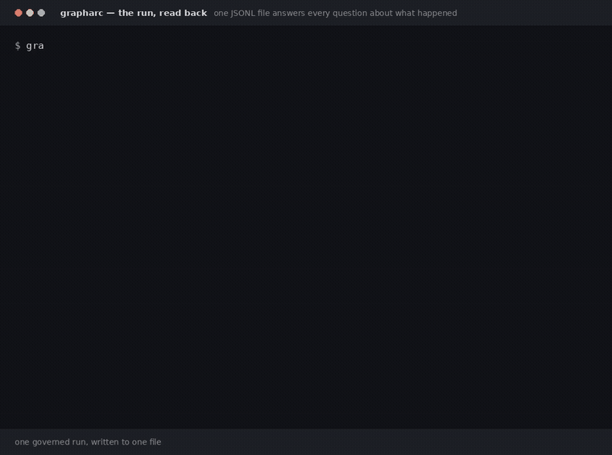

# GraphARC, in depth

The long-form version of the front page: every mechanism, every edge,
every limit. The [README](../README.md) is the pitch; this is the manual
alongside the [cookbook](cookbook/).


## What it adds on top of LangGraph

Everything in this table is enforced by the library rather than left to convention, and has a test you can run.

| Discipline | Mechanism |
|---|---|
| Write permissions | Every node declares which state fields it may write. An undeclared write raises `WritePermissionError`; plain LangGraph applies it and moves on. |
| State isolation | Nodes receive `state.model_copy(deep=True)`, so mutating a nested model in place cannot sneak past the declared write channel — the returned dict is the only way out of a node. |
| Typed state | Schemas are Pydantic models with `extra="forbid"`. Declaring a write to a field that doesn't exist fails when the node is added, not when it runs. |
| Earned cycles | `dag=True` rejects conditional and fan-out edges when they're added, and cycles at compile time — Stage 0 before Stage 2. |
| Code-only routing | Routers are ordinary Python functions over typed state, so model prose cannot steer an edge. A node may also return `Command(goto=…)` for dynamic routing — still code — and the destination is validated against the compiled graph at the node boundary. |
| Convergence | `ProgressGuard` returns the first triggered `StopReason` (target met / no progress / round cap), so a cycle ends with a machine-readable reason instead of running out of road. |
| Traces | Each node execution writes JSONL `start` / `end` / `error` events. `start` carries only the identity of the step (run, thread, attempt, graph, node, step, timestamp); `end` adds the state delta, duration and tokens; `error` adds the duration and the exception. `metrics`, `viz`, `replay`, `diff` and the OTel exporter read that same file, so the dashboard and the audit trail cannot disagree. |
| Fail-closed entry points | Driving a compiled graph through raw LangGraph (`.inner.invoke()`) raises `MissingRunContextError` rather than silently running with no budget and no trace. |
| Bounded work | A per-run `Budget` (iterations / tokens / seconds / concurrency). Iterations and tokens are metered by the runtime itself, and `max_seconds` is delivered as an interrupt *into* the running node rather than only checked between them. |
| Checked state edits | `update_state()` is not a passthrough: it rejects unknown fields, type-checks the values, and — given `as_node=` — applies that node's declared write allowlist. |
| Governed topology | New nodes and edges proposed at runtime go through a deterministic admission gate before anything is built. See [The admission gate](../README.md#the-admission-gate). |

Three of those need their edges stated, because the gap is where people get hurt.

**Budgets.** Tokens are charged without the node's cooperation: a LangChain callback is installed for the duration of every node, so any chat model invoked on that thread reports usage to the run's meter — including calls buried inside library code the node merely calls — and the ceiling is enforced at the node boundary. `max_seconds` is an interrupt, not a poll: SIGALRM on the main thread, an asynchronous exception otherwise, so a node parked in `time.sleep` or on a provider's socket is cut off at the deadline. Where it stops short: spend a provider never reports cannot be charged, a model invoked on a thread the node started itself is outside the callback's context, and an async exception cannot unwind a thread sitting inside a C call — it lands when that call returns. Even then the deadline holds at the node boundary: a node that overran does not get its writes into state.

**Routing.** The routers are code, which is the property that matters: no model output is ever consulted to pick an edge. `add_conditional_edge` checks the mapping where it is declared — an empty mapping is refused, every target must name a node the graph has or `END`, and a router annotated with what it returns (a `Literal`, an `Enum`) has those members held against the mapping's keys. Where it stops short: a router that declares nothing is not second-guessed, so the key it returns is only known when it returns one. That case is no longer a bare `KeyError` from inside LangGraph's branch machinery — it raises `GraphRoutingError` naming the node, the key and the keys there were — but it is still discovered by a run rather than by `add_conditional_edge`.

**Typing.** Writes are checked in both directions: the dict a node returns is validated field by field against the state schema before it lands, and the state is validated again when the next node receives it. A value that doesn't fit raises `StateTypeError` naming the node, the field, the declared type and what arrived — and that includes the last node before `END`, so a bad type no longer escapes into the result. The validated value is what gets written, so a schema that says `int` means the result holds an `int`. The remaining gap is narrow and worth stating exactly: write-time validation is built from each field's *annotation*, so constraints carried in the annotation (`Annotated[int, Field(gt=0)]`) do bite, but a validator the state model declares for itself — `@field_validator`, `@model_validator` — is not run on a write. A node returning `{"slug": "NOT-LOWER"}` into a field whose validator demands lowercase is accepted, even though constructing the model directly with that value raises; the violation surfaces only when a later node receives the state and the whole model is rebuilt, which means one written by the last node before `END` still reaches the result. The write *allowlist* is GraphARC's; the *types* are Pydantic's.

**Crash-safe resume is LangGraph's**, not GraphARC's: a checkpointer handed to `compile()` goes straight to `StateGraph.compile()`. What GraphARC adds on top is trace continuity — after a resume, step numbers continue from the thread's history and the attempt counter increments, so replay points stay unique across attempts. What `grapharc.session` adds on top of *that* is everything the kernel deliberately does not know about: who is driving the thread, what has been said to it since it last ran, and whether a human still has to sign something off.

**Async is carried through.** `ainvoke`, `astream` and `astream_events` all run through the same disciplined path — budgets, traces and write permissions apply unchanged — and `async def` nodes execute. The sync entry points refuse a graph containing them with `AsyncNodeError` *before* anything runs, rather than letting LangGraph execute every sync node first and fail at the first coroutine. `astream_events` offers `v1` and `v2`; `v3` is refused because LangGraph returns a stream object there rather than an async iterator, which is a different contract than the method's.


## Architecture


The amber curve along the top is the claim: refusals return as traced reason codes, and work discovered mid-run **re-enters admission** — there is no already-approved path and no cached authorisation. 

For detailed architecture views, see [`docs/diagrams/grapharc-architecture.drawio`](diagrams/grapharc-architecture.drawio) and [five more views](diagrams/) generated from [`architecture.py`](diagrams/architecture.py).

| Component | Purpose | Module |
|---|---|---|
| **Kernel** | Typed state contracts, declared writes, budgets, traces, fan-out, async support | `grapharc.runtime` |
| **Planner + Admission** | Propose subgraphs, admit/reject with reasons, materialise, replan | `grapharc.planner` |
| **Agent Node** | Observe → model → permission check → sandboxed tool → repeat loop | `grapharc.harness` |
| **Tools** | Seven core tools with workspace confinement; container executor | `grapharc.tools` |
| **Sessions** | Long-lived, resumable across processes, human approval gates | `grapharc.session` |
| **HTTP API** | FastAPI + Server-Sent Events for streaming | `grapharc.server` |
| **Policy** | TOML rules over nodes, edges, tools and spend; decision audit trail | `grapharc.policy` |
| **Memory** | Durable claims with provenance, artifacts, BM25F + graph retrieval | `grapharc.memory` |
| **Observability** | Replay, run diffing, OpenTelemetry spans, cost attribution | `grapharc.observe` |

Every component above is reachable from a shipped command. See [ROADMAP.md](../ROADMAP.md) §12 for known gaps — the HTTP API still runs its own in-process session layer instead of the durable one.


## The model gateway

The primary backend drives the **Claude Code CLI** (`claude -p`), so GraphARC runs on a Claude subscription with no API key. That CLI is a full agent, so the adapter invokes it as a pure inference endpoint: every tool disallowed, no settings sources loaded, no CLAUDE.md pickup, prompt via stdin, flags via an argv array — never a shell string. An injected "run this command" has no tool to run it with.

```python
from grapharc.gateway import get_model

# Subscription, no API key — but text completion only.
worker = get_model("claude-cli/claude-sonnet-5")

# OpenRouter: one key for a catalog spanning most vendors, with
# tool-calling, structured output, streaming, and async.
worker   = get_model("openrouter/anthropic/claude-haiku-4.5")
reviewer = get_model("openrouter/openai/gpt-4o-mini")   # a genuinely different vendor

# Or go direct: your own OpenAI key, or a model on your own machine.
reviewer = get_model("openai/gpt-4o-mini")              # OPENAI_API_KEY
local    = get_model("ollama/llama3.1")                 # no key, no bill, no egress
```

A spec is `backend/model`. A mistyped *backend* with a slash is rejected — `openrouterr/x` exits 2 naming the known backends. But a **bare name with no slash is treated as a model on the `claude-cli` backend**, so `--model mock` reaches the Claude subscription with a nonsense model name rather than the scripted double; the double needs `mock/anything`. Worth knowing before you type a bare spec, because that backend spends subscription quota. `grapharc models` shows what a spec resolves to.

Run an example graph against real models:

```bash
grapharc demo stage5 --model openrouter/anthropic/claude-haiku-4.5 \
                    --reviewer-model openrouter/openai/gpt-4o-mini
```

OpenRouter also carries routing: model-level `fallback_models` chains, provider `order` / `sort` / `max_price`, and per-call cost in the usage envelope. Every backend reports usage in the same shape, with cached input folded into the total, so a budget meter reads the same fields whichever one produced the turn. `openrouter`, `openai` and `ollama` share a base class — same tool-calling, streaming, retry policy and envelope — and differ only in routing and in where a price comes from.

**Retries have a policy, not a loop.** Three attempts by default, 0.5s initial backoff doubling to a 20s cap, with jitter drawn from `[0.75, 1]` — shrinking rather than centred, so successive delays stay strictly increasing rather than merely trending upward. What gets retried is the deliberate part: a timeout, a connection reset, a 429 or a 5xx is transient and re-issued; a 400, 401, 402, 403 or a content refusal is a verdict that will not change and is raised on the first attempt; anything unrecognised is treated as deterministic rather than retried hopefully. A `Retry-After` header raises the delay but never lowers it, and is itself capped. Streaming is not retried — once a chunk has reached the caller the request cannot be re-issued transparently.

**Cost ceilings are enforced, on both sides of a call.** A `SpendMeter` refuses before a call once the ceiling is reached, and after a call it charges the cost and *then* raises if that crossed the line — so overspend is bounded by the single call that crossed it rather than discovered a node later. The limit worth stating: a call whose cost the provider does not report cannot be charged, and those land in `unpriced_calls` rather than being guessed at. `unpriced_calls > 0` means the ceiling saw less than the whole bill.

Caveats each backend accepts openly. **Claude CLI:** `bind_tools` and `with_structured_output` raise `NotImplementedError` — the adapter implements neither, so what you get is LangChain's `BaseChatModel` default, and `claude -p` in the tool-free mode GraphARC drives it in offers nothing to implement them with. GraphARC also has no cache control on this path — the CLI decides and the usage envelope reports what it did — and calls spend subscription quota. **OpenRouter:** credit is reserved against `max_tokens`, so the default is deliberately modest. **OpenAI:** the API returns token counts and no price, so `cost_usd` is `None` and a dollar ceiling counts calls instead of enforcing — pass `price_per_million=` or price the trace afterwards with `observe.cost.RateCard`; token budgets are unaffected. **Ollama:** free by definition, so calls are charged `0.0` rather than counted as unpriced, and whether tool-calling works depends on the model you pulled rather than on the adapter. **All of them:** the per-call `cost_usd` is captured, budgeted against, *and* written onto the trace, so `observe.cost` reports a recorded figure rather than an estimate whenever the provider gave one. See [ROADMAP.md](../ROADMAP.md) §10.4 for what is still missing (a tenant on the event).


## Tools and the harness


Every diamond above is code, not prompt text. The `deny` branch is the one to look at: a refused tool never reaches the sandbox and its schema is never shown to the model, so the model is not asked to be well-behaved about a tool it cannot see.

Seven core tools — `read_file`, `write_file`, `edit_file`, `list_dir`, `glob`, `grep`, `run_command`. `grapharc agent <task>` registers them into a `ToolRegistry` that an `AgentNode` then drives, so the CLI path is the worked example. `grapharc/examples/agent_fixit.py` is a shipped *graph* that calls tools, though it defines its own inline rather than using these; the other example stages call no tools at all.

- **Confinement is in the tool, not only the executor.** Every path argument is resolved and checked against the workspace by the tool itself, independently of whichever executor is running it — because `LocalExecutor` confines nothing, and a tool is the last thing standing between a model-supplied `../../.ssh/id_rsa` and the file. Both a traversing `../../../etc/passwd` and an absolute `/etc/passwd` raise `WorkspaceEscape`.
- **Permissions decide which tools run.** Deny → ask → allow, first match wins, and an unmatched tool defaults to deny. A denied tool's schema is never shown to the model — it isn't described and then refused, it's invisible.
- **The executor bounds what a tool touches.** The default runs the tool in a forked child under a CPython audit hook that confines filesystem paths to the granted workspace *plus the interpreter's own runtime paths*, refuses sockets unless the tool declared `needs_network`, refuses subprocess spawning outright (a child would run unhooked and therefore unconfined), and SIGKILLs the whole process group on timeout.

**`run_command` is a decision of a different size from the rest**, and is documented as one. It takes an argv **list** and never a shell string — `shell=False` always, a single string is refused rather than split, and a pipeline is spelled `["bash", "-lc", "…"]` so it stays explicit and visible in the tool-call record. But the child it spawns runs outside every guard in the package: its cwd is workspace-resolved and its environment is an allowlist, and past that it is an ordinary process with your privileges that can reach the whole filesystem. What limits it is the permission policy deciding whether it may run at all, plus whatever real boundary the executor provides. It cannot run under `SandboxedExecutor` at all — that executor refuses subprocess spawning, so the pairing raises `SandboxViolation` every time.

**What the audit-hook boundary is, precisely: in-process confinement, not a kernel sandbox.** An audit hook constrains only the interpreter it is installed in, and its coverage is a maintained list of audit events rather than a guarantee — CPython raises no event for `os.stat`, so metadata reads outside the workspace are still not blocked. What has changed since this paragraph was first written is the sharper edge it used to describe. The runtime-path exemption is now **read-only**: reads and mutations use separate grants, so a sandboxed tool trying to drop a `.pth` file into `site-packages` — a full escape that would outlive the run — is refused with `SandboxViolation` and no file appears, while stdlib reads still succeed so imports keep working. Treat the whole thing as defense in depth against a confused tool, not as containment for a hostile one.

**Where a real boundary is needed, `ContainerExecutor` is it.** Same `run(spec, args)` interface, so callers never branch on which executor they hold. It runs each tool call in a throwaway container with one bind mount (the workspace), `--network none` unless the tool declared `needs_network`, all capabilities dropped, `no-new-privileges`, a non-root uid, a read-only rootfs, and memory and pid limits. Its constraints are enforced rather than documented away: the tool must be resolvable *inside the image* — a lambda, a `functools.partial` or a bound method is refused before a container starts, and a derived import path that cannot be checked without running host code is refused *there* instead, contained — and arguments and results must survive JSON. The image is part of the security decision and is yours to choose; the default `python:3.12-slim` contains no GraphARC and none of your code, so running your own tools means building an image that has them.


## Memory

Claims carry provenance — source, observation time, and the run that produced them — and corrections are recorded by supersession rather than overwrite, so a later run can see that a fact was replaced and skip the dead end. Entity resolution is Unicode-aware, so 東京 and 北京 stay distinct instead of both collapsing to an empty key.

**It has a disk.** `SQLiteMemoryStore` and `SQLiteArtifactStore` share one file and are verified durable across genuinely separate processes, not merely across objects. Artifacts are append-only with versions rather than overwrites, provenance is mandatory, and blob content is written before the row that references it — so a crash leaves an unreferenced blob (garbage) and never a row pointing at content that does not exist (a lie).

**And it has a graph backend, if the rows are not the shape you want.** `LadybugMemoryStore` implements the same `ClaimStore` protocol against [LadybugDB](https://ladybugdb.com/) — an embedded property-graph database with Cypher, forked from Kuzu after Apple closed it. The two SQLite-shaped backends keep claims as rows and rebuild the adjacency in Python on every `ClaimIndex`; this one stores the edges, so `superseded_by` is a `SUPERSEDED_BY` edge and a correction chain is a path you can walk in Cypher rather than a scan you pay for. It buys queryability, and it costs concurrency: LadybugDB takes an exclusive lock on the database, so one process may write it or several may read it, never both at once — sequential hand-off between runs works, concurrent multi-process writing does not. A test spawns a second process against a held database and asserts the failure, so that sentence cannot rot. Install with `pip install 'grapharc[ladybug]'` — the distribution is `real-ladybug`; the `ladybug` name on PyPI is an unrelated building-science package.

**Retrieval is real, and its limits are arithmetic rather than adjectives.** Okapi BM25F over subject + predicate + object with the subject weighted highest; an optional injected vector channel that stays silent below a similarity floor instead of confidently returning its least bad row; and graph traversal that reads a claim's object as an entity, so a question about A reaches facts about B, each hop decaying the inherited score. Scoring needs corpus statistics, so it is O(claims) per call — nothing here is sublinear and nothing here pretends to be. `render_context` takes `max_tokens`, so what reaches a node is budgeted.

**Contradiction detection reports; it never resolves.** A new claim sharing a normalized (subject, predicate) with a stored one and differing in object is flagged. That is a structural test: it will not relate "is fast" to "is slow", will not match a rephrased object, and *will* flag a legitimately multi-valued predicate as disagreement. Auto-superseding on a detected conflict would delete half a multi-valued fact inside the one subsystem whose promise is that facts are never destroyed, so a caller supersedes on purpose or not at all.

The limit to know: **the in-process store is still the default.** `grapharc demo stage6` and `grapharc demo capstone` keep claims in a dict for the life of the process unless you pass `--memory PATH`, which hands them the `SQLiteMemoryStore` — verified to survive across two separate interpreters, not just two calls in one. In-process stays the default so a plain run writes nothing you did not ask for. The durable stores that exist are `SQLiteMemoryStore` (no extra needed) and `LadybugMemoryStore` (the `ladybug` extra); there is no extra beyond those.


## Sessions, the HTTP API, and policy

**Sessions survive a process restart.** A `SessionManager` over a directory keeps status, the event queue, approval holds and the audit trail in SQLite, with graph state in the kernel's checkpointer. Verified by running it: one interpreter created a session, ran two nodes and stopped `awaiting_approval` holding a gated node; a second interpreter resumed it by id, saw the hold, approved it, and ran the rest — with each node appearing exactly once in an append-only log, so nothing was repeated and nothing skipped. The resuming process must register the graph in its own registry, or it gets `UnknownGraphError` rather than a guess.

Three things that phrase over-promises if left alone. **An interrupt does not stop a running node** — it is read at the next superstep boundary, after the whole parallel step has finished and been checkpointed, so a node already inside its body runs to completion. **The approval gate is enforced by the session runtime, not by the graph**: driving the same compiled graph directly runs gated nodes with nothing holding them. **A turn is synchronous** — the kernel grew `astream` while this was being written, and an async turn is buildable and simply not built.

**The HTTP API is FastAPI plus SSE** — create a session, list, get, post an event, stream the trace, fetch it as NDJSON, healthz. A request may name a registered graph and supply input and a budget; it may not *describe* a graph, because topology comes from a registry the operator fills in Python. But note the seam: **it does not use the session layer above.** It ships its own in-process runtime whose sessions die with the process, never evict, and record `message` and `approval` events without delivering them into a running graph. Two session layers that have not been joined ([ROADMAP.md](../ROADMAP.md) §12.3).

**Policy is a TOML document** over nodes, edges, tools and spend, with tiered evaluation — every `deny` before every `ask` before every `allow`, so a broad deny beats a narrow allow including one scoped to a single tenant. Every decision lands in an audit record naming the rule id, the reason, the policy version and a digest of the document, so a decision can be tied to the exact text that made it. And the seam, now narrowed to the tool plane: **the planner half is wired and the tool half is not.** `PolicyEngine.edge_policy()` and `PolicyEngine.node_policy()` compile the document into the `EdgePolicy` and `NodePolicy` the admission checker consults, and `grapharc plan --policy` is a real caller — so what may run, and what may connect to what, *is* governed by a document you can read. (A `resource = "node"` rule used to be dropped by the compiler and enforced by nothing; [issue #66](https://github.com/CodeGraphContext/GraphARC/issues/66).) But `permission_policy()`, `check_tool()` and `approval_router()` have no caller outside `grapharc/policy/`, so `grapharc agent` still assembles its tool gating from `--allow` / `--deny` / `--ask` globs. The most dangerous surface in the package is the one the document cannot reach yet; [issue #6](https://github.com/CodeGraphContext/GraphARC/issues/6) is that work, and the precedence question it has to settle is what happens when a flag `allow` meets a document `deny`.


## Independent verification

`verify_claim` is the piece worth copying even if you use none of the rest.

- **The anchor runs before the model.** The citation must appear verbatim in the source (whitespace is the only latitude, so a paraphrase is still caught). A fabricated quote is rejected with the reviewer's call count still at zero — a hallucinated citation costs nothing.
- **The reviewer gets a fresh context.** If the anchor holds, the reviewer sees only the claim, the quote, and a mechanically extracted window of surrounding source — never the author's conversation. That window is what lets it catch a real quote lifted out of a negated sentence.
- **Ambiguity fails closed.** An unparseable reply, a non-boolean `supported` value, or a citation under 12 characters is a rejection.
- **Independence is enforced in two places, both worth knowing exactly.** `build_stage5` and `build_capstone` refuse the *same object* for author and reviewer — an identity check, which will not catch two separate instances of the same model. The CLI does the stronger check: `different_providers()` compares the *vendor* each spec reaches — the model author when the id names one, the backend's own vendor otherwise, so a Claude-CLI author and an Anthropic model over OpenRouter are correctly read as correlated — and `grapharc demo --model … --reviewer-model …` warns when the pair shares a vendor, because correlated agreement is exactly what the verifier exists to prevent.


## Reading a run afterwards

`trace` is the only writer. `metrics`, `replay`, `diff`, `cost` and the OTel exporter all read that one file and nothing else, which is what keeps a dashboard from contradicting an audit trail.

```bash
grapharc replay trace.jsonl <run-id>          # node sequence, folded state, timing
grapharc diff   trace.jsonl <run-a> <run-b>   # what changed between two runs
grapharc metrics trace.jsonl <run-id>         # tokens, retries, termination reason
```



*Two runs, one file. The second was given a smaller `--max-tokens`, so admission priced the proposal, refused it, and no node started; `diff` reports that as `path 3 -> 0 nodes`. Free and deterministic — see [docs/demo/](demo/).*

**Replay is a reconstruction, not a re-execution.** It rebuilds the node sequence, the folded state, the timing and the failures from the JSONL and calls no model, no tool and no node. Two limits come from the recording side rather than this one, and both are in the signature rather than a comment: strings past 2,000 characters were truncated when they were written, so they replay truncated; and the trace does not record which state fields have reducers, so a field LangGraph appended to replays last-write-wins unless you pass the reducer.

**Spans are optional by construction.** One root span per run, one child per node execution, with `AgentNode` sub-steps parented by inference — and a sub-step whose parent cannot be identified is parented to the run span rather than to a guess. The OpenTelemetry dependency is confined behind a Protocol, so importing the module needs no OTel installed. This was carried as unverified against the real SDK for a while; it has now been run against `opentelemetry-sdk` 1.44.0 with spans arriving at a real exporter.

**Cost attribution is per run, thread and node**, and it distinguishes what was measured from what was guessed. Tokens are counted from the same events `metrics` uses — node `end` events plus work that happened outside any node span, which is what a `grapharc agent` run is entirely made of — and the suite asserts the two agree, so a cost report and an audit trail cannot drift apart. The provider's own `cost_usd` is written onto the trace, so `recorded_cost_usd` holds a real figure when the backend reported one; a backend that reports none falls back to tokens priced against a `RateCard` you supply, and the two never mix. There is still no tenant on a trace event, so per-tenant attribution is not offered rather than being approximated.


## Configuration, and the zero-config path

Three flags carry every run: `--registry` (what may be proposed), `--policy` (what may connect to what), `--model`. Typing them repeatedly is how people stop using a tool, so they can come from a file:

```toml
# grapharc.toml
[grapharc]
registry   = "myco.incident:build_registry"
policy     = "policy.toml"
max_rounds = 6
```

Resolution is `flag > env (GRAPHARC_*) > grapharc.toml > built-in`, and **every value reports which layer supplied it** — `--json` carries a `sources` block, the human view prints a `config` line. A config file makes "which policy was I subject to" *less* visible on the command line, so the provenance is part of the output rather than something a reader reconstructs.

**It does not search parent directories.** git, npm and cargo all walk upward; this deliberately doesn't. A run must never be silently governed by a policy file in a directory you didn't know about. Read from the working directory, or name one with `--config PATH`. A relative path *inside* a config resolves against the config, so the file means the same thing from anywhere.

**With nothing configured at all**, a run still works. [`grapharc.stdlib`](../grapharc/stdlib.py) ships general-purpose node kinds — `collect_context`, `investigate`, `verify`, `summarize`, and `apply_change`, which is registered *and denied by default*. No phase anywhere is given `run_command`. If a model is available and no policy was named, one is **generated**, written to `.grapharc/generated-policy.toml` with a `REVIEW THIS` header, and reported as `policy_source: generated`. The second run reads it off disk as an ordinary file — so generation is a one-time state, and promoting it to a policy you own is an edit and a `mv`.

**Policy is generated; a registry never is.** Policy is data, and the worst case is bad rules you can read. A registry holds *functions*, so generating one would mean a model writing code that then executes — and the gate would be checking a list the gated thing wrote. The model selects from the shipped kinds instead. Selecting is safe; authoring is not.


## Tests are gates

Each stage ships a failure-gate test, not just a happy path:

- **Stage 0** — an injected failure between the temp write and the rename leaves no report at all; resuming the same thread from its checkpoint produces exactly one, with no orphaned temp file, and both attempts are on the trace with non-overlapping step numbers. (The failure is an in-process `RuntimeError`, not a killed process — write atomicity and checkpoint resume are what this actually tests.)
- **Stage 1** — an impossible task halts on a no-progress window within three rounds of a hundred-iteration ceiling, with `no_progress` recorded; a round cap is a second, independent brake.
- **Stage 2** — a bad model output is attributable to the exact node, step and state delta, and the checkpoint history holds a replay point from just before it was caught. Three rounds of prose, including a literal `ROUTE TO: all_verified` injection attempt, cannot move the router: the run ends on the deterministic attempt cap with nothing verified.
- **Stage 3** — one crashed worker and one hung worker out of three still produce an answer, with both failures recorded by cause; overlapping shards manufacture duplicate evidence and `unique_sources` still counts chunks rather than repetitions.
- **Stage 4** — an impossible investigation halts on a no-progress window, far under the hard ceiling.
- **Stage 5** — a fabricated citation is rejected with the reviewer never called; a quote mined from a negated sentence reaches the reviewer with the surrounding context that exposes it; unparseable replies, non-boolean verdicts and trivial citations all fail closed; the reviewer's prompt is checked to contain the evidence window and not the author's conversation.
- **Harness** — a tool cannot read a file, list a directory, delete a file or remove a directory outside its workspace, cannot open a socket without declaring the capability, and cannot spawn a subprocess; a sibling directory whose name merely starts with the workspace path is not treated as inside it; a tool cannot plant a `.pth` in `site-packages` while stdlib reads still work; a hung tool and a tool that installs a SIGTERM handler and keeps working are both killed for real.
- **Stage 6** — three runs against a shared store: a later run reuses an earlier fact, sees what superseded it, and is shown the dead end with its provenance.
- **Capstone** — a reviewer that rejects everything yields no answer and zero memory writes.
- **Admission** — renaming a denied kind does not evade the policy, and neither does hiding the rename in a nested scope; naming an instance after a permitted kind does not borrow that kind's permission; a live node listed without a kind cannot be wired at all rather than being waved through; an already-overspent run admits nothing that costs; every failed check is reported, not just the first; and admission events do not pollute the run metrics.
- **Sessions** — a second runner cannot claim a running session; a decision naming a different request does not release the hold; approving one held node does not release the others.
- **Server** — a sink exception cannot fail the node that recorded the event; a rejected create leaves no session and no trace directory; the SSE stream and the trace file are the same record, including for an answer over 2,000 characters; a state value JSON cannot hold appears on both views.
- **Container** — tests that need a real runtime skip themselves when no runtime or image is present, and never pull one.

```bash
uv run pytest          # scripted models: deterministic and free
uv run pytest -m live  # real backends: spends money and quota
```

Live tests are deselected by default via `addopts` in `pyproject.toml`, so a plain `pytest` never reaches a real model — verified: a plain run reports 10 deselected. `--strict-markers` is on, and a misspelled marker is a collection error rather than a test that silently spends money.


## Limits

A stable system is not one that claims to have no edges — it is one whose edges are documented and tested. Everything below is re-derived by running each item, not by reading the commit log; most recently on 2026-08-05.

**Distribution**

- **`0.1.0` on PyPI reports the wrong `__version__`.** The published wheel's metadata says `0.1.0` — `pip show` and the project page agree — but the module inside it still carries `__version__ = "0.1.0a0"`, because it was built from a tree where only `pyproject.toml` had been bumped. PyPI releases are immutable, so `0.1.0` cannot be corrected in place; every release since `0.1.1` carries the matching string, and a test now pins the two together.

**One seam**

- **The HTTP API does not use the durable session layer.** It has its own `InProcessRuntime`, whose sessions die with the process and whose approvals are recorded without being delivered. [ROADMAP.md](../ROADMAP.md) §12.3.

**The MCP supervision surface**

- **The MCP gate binds the MCP surface, not the host.** The server exposes no approval verb, so a supervised agent cannot decide over its own connection — but the host agent holds its own Write and Bash, and a process in the run directory can forge `approval-decision.json`. The trust boundary is the working directory, the same posture the Slack gate documents for its workspace; the shipped skill states the never-clauses for the hands the server cannot see.
- **The host's tool-permission prompt is UX, not enforcement.** Allowlists and skip-permissions modes erase it, and GraphARC cannot observe it. The park on the file handshake is the gate; the prompt is a courtesy in front of it.
- **A parked `execute` lives inside one MCP call.** A host that times the tool out kills the wait; the plan stays unexecuted and the call is safe to reissue. Approval records the decision, never the decider — the trace has no actor field.

**Real limits of things that do work**

- **Concurrent fixers conflict as data, not as prevention.** Write leases cover `write_file`/`edit_file` only: the second writer to a path is refused with the holder named and the refusal lands in the loser's report, but `run_command` children and delegated tools mutate un-leased, a lease is advisory within one process rather than a cross-process file lock, and nothing merges divergent edits.
- **Admission authorises a kind; its arguments only where the kind declared a schema.** `NodeSpec.args_schema` puts a proposal's `args` under `Check.ARGS`, and the validated dump is what reaches the factory. A kind without one keeps the old contract: `args={"path": "/etc/passwd"}` is admitted on the strength of the kind alone, and dropped unless `forward_args=True`. Either way the schema bounds the argument's shape, not what a factory lets it reach — the shipped registries feed an admitted argument to a prompt, never to a tool call.
- **The audit-hook sandbox is in-process confinement, not a kernel boundary.** `os.stat` outside the workspace is not blocked, because CPython raises no event for it. `ContainerExecutor` is the boundary where one is needed.
- **`run_command` is not confined.** Argv-only and never a shell, but the child is an ordinary process with your privileges.
- **`interrupt()` suspends but cannot be resumed.** LangGraph's native interrupt stops the graph and shows on `get_state`, and there is no supported resume path — resuming means passing a `Command` as *input*, which is closed by design. Use the session layer's approval gate for human-in-the-loop.
- **Still unwrapped from LangGraph:** `retry_policy`, `cache_policy`, `durability`, subgraphs. `.inner` reaches them, but execution entry points there fail closed, so `.inner` is an inspection escape hatch and not a way to run the graph.
- **Cost is recorded when a backend reports one, estimated when it does not.** Both gateways publish the provider's `cost_usd` through the same `llm_output` envelope, the runtime's usage callback writes it onto the node's `end` event, and an agent's `model` events carry the per-call breakdown. A backend that reports no price still falls back to a `RateCard` estimate, and the two figures stay apart — `recorded_cost_usd` is never a guess. Still missing: no tenant on a trace event, so per-tenant attribution is not offered.
- **A node's tokens are its own, not the run's movement while it ran.** Worth stating because it was the other way round: an `end` event carried the difference between two readings of the run's *shared* meter, so under fan-out the workers' windows overlapped and each was credited with its siblings' concurrent spend. Three workers costing 8 tokens each traced as 24/16/8, and `metrics` and `cost` agreed on 48 for 24 tokens of real work — doubling the estimated bill purely because the work ran in parallel. Attribution now comes from a per-node scope on the meter, so the same work costs the same serially and in parallel; a hand charge the usage callback never saw still lands on the node that made it.
- **A planning round is an envelope, not a measurement.** A `round` event used to carry the planner's `tokens` and the round's `duration_ms`, both of which `metrics`, `cost` and `replay` add on top of node totals — and the planner's spend was already reported by its own `plan` event, so it was counted twice, and a round's duration encloses the plan plus every node it ran. Neither is on the event now; both are on its `state_delta` as `round_tokens` / `round_iterations` / `round_duration_ms`, where no reader sums them. `RoundRecord.iterations` also holds a figure now rather than always `0`.
- **The Claude CLI backend is completion-only, and an agent node on it is *delegated* rather than governed.** The CLI has no tool-calling wire format, so GraphARC cannot run its own gated loop over it. Rather than refuse, `AgentNode` hands the whole loop to Claude Code's headless agent, in one of two named tiers. `allowlist`, the default, pre-approves exactly the Claude Code twins of the node's own registered tools (`read_file`→`Read`, … `run_command`→`Bash`), so one operator declaration governs both the governed loop and the delegated one — but the enforcement is Claude Code's own gating, not this graph's per-call policy, there are no per-tool trace events, and anything unlisted falls to headless default gating, which fails closed. `bypass`, explicit opt-in only, runs `bypassPermissions`: every tool Claude Code has, no checks at all. In either tier the calls are not confined by the sandbox executor and the token figure is the sub-agent's own rather than one GraphARC metered call by call; a `--max-tokens` the delegated path cannot enforce is refused rather than silently unapplied. The workspace boundary and the wall-clock ceiling still hold — the CLI runs in its own session, and the deadline kills the whole process group, not just the direct child. It warns on `DelegatedToolUseWarning` at construction, naming the tier, and marks every trace event `executor=delegated` with its `delegated_mode`; filter that warning to an error to get the old refusal back. Structured output still needs an OpenAI-wire backend: `openrouter`, `openai`, or a local `ollama`.
- **A session turn is synchronous**, and a runner claim is a claim rather than a lease — nothing reclaims a session whose runner died holding it.
- **`.env` and `grapharc.toml` follow the same discovery rule: the working directory, and nowhere else.** Neither searches parent directories — a run must not be governed by a file you did not know about, and must not be *billed* to one either. **This is a behaviour change:** the credential loader used to walk up to `/`, so a `.env` in an ancestor directory (a `$HOME` one on a shared box, a client project one above a demo checkout) was picked up silently. If you relied on that, move the file into the directory you run from, `export` the variable, or pass `env_file=` to name it explicitly. A real environment variable still beats any file.
- **`grapharc run` has no budget unless you give it one.** Set any of `--max-tokens`, `--max-iterations`, `--max-seconds`, or `--max-concurrency`; without them each dimension is unlimited and the gate admits a topology of any worst-case cost.

**Verified this pass:** `pytest` → green, 2,151 selected and 13 deselected (the live ones); `ruff check .` clean; all eight `grapharc demo` stages green, plus the `trace` / `metrics` / `viz` / `replay` tour against a freshly recorded demo trace; the wheel builds and imports all submodules in a clean virtualenv with `[all]`, and `0.1.6` on PyPI is that wheel. The counts are a snapshot, not a property of the project — `pytest` re-derives them in one command, which is the only reason they are quoted, and `tests/test_deep_dive.py` fails this line rather than letting it drift.

[ROADMAP.md](../ROADMAP.md) tracks what is built and what is not, item by item.

Defects that have been **closed** — each with what broke, how it was found and what the fix actually guarantees — are in [CHANGELOG.md](../CHANGELOG.md). They were moved there because a list headed *Limits* should say what is still true.


## Design lineage

Architecturally *inspired by* systems studied from public documentation: OpenClaw (policy-before-schema tool gating, file-first state, and its security post-mortems), Hermes Agent (budgeted tiered memory, ephemeral subagents), Claude Code (advisory-vs-enforced split, subagent context isolation, verification-centered loops), and OpenRouter (routing semantics, budget-scoped accounting).


